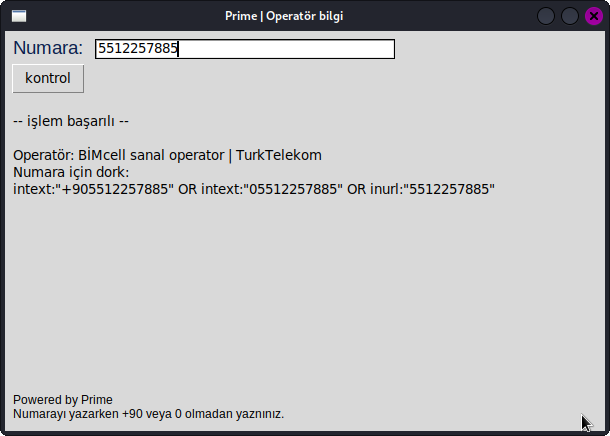

# Operatör bilgi

Kullanımda olan numaraların formatı gereği ilk 3 hanesi 0 & +90 hariç bize operatör bilgisi vermektedir. Kullanımı karmaşık olmasın diye direk 10 haneli numara girişi istemektedir
Ayrıca php apiside bulunmaktadır herhangi bir ek bağlımlık yoktur. 

<h1>Arayüzü:</h1>

